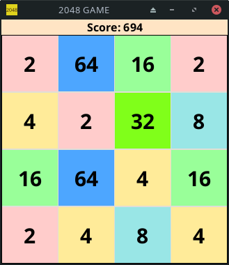

# Simple-2048-Game 🎮

Simple-2048-Game is a straightforward implementation of the popular 2048 puzzle game, crafted with JavaFX.

_Note: If you have a screenshot of the game, you can place it in an appropriate directory in the repository and update the path above to showcase the screenshot in the README._

## 🚧 Project Status 🚧

The project is currently under development and is not yet ready for full use. However, you can run and test its current functionalities.

### To Be Implemented:

- [ ] Win condition
- [ ] Lose condition
- [ ] Displaying score

## 💡 How to Run

! Ensure you have the necessary tools installed: Java (version 17 or newer) and Maven.
Clone this repository:
`git clone https://github.com/Hathor875/Simple-JavaFX-2048-GAME.git`
Navigate to the project directory:
`cd Simple-JavaFX-2048-GAME`
Run the game using Maven:
`mvn javafx:run`
